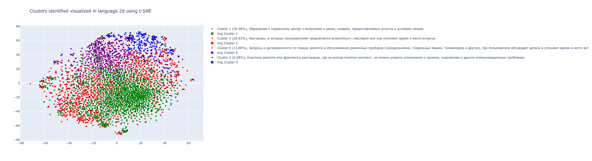

## Text clustering
Here are two examples, of how to get embeddings:  
1. OpenAI API  
2. Locally by PyTorch on GPU  
  
The final step is Cluster naming, which utilizes a LLM.  
This repo uses the OpenAI gpt-3.5-turbo-16k model to clarify the difference between clusters' samples.
#### Input
Pandas dataframe:  
| Unnamed: 0 |  id           | text      |  
|------------|---------------|-----------|  
| 0          | 1.689907e+09  | Text 1... |  
| 1          | 1.689908e+09  | Text 2... |  
| 2          | 1.689909e+09  | Text 3... |  
#### Output

#### Links
* [OpenAI: Embeddings / Use cases / Clustering](https://platform.openai.com/docs/guides/embeddings)
* [PyTorch: Word Embeddings: Encoding Lexical Semantics](https://pytorch.org/tutorials/beginner/nlp/word_embeddings_tutorial.html)